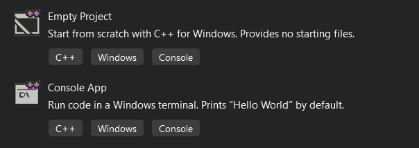

## Какво е IDE
Файловете с изходен код на C++ сами по себе си представлят обикновни текстови файлове. Необходим е компилатор за да се преведе(компилира) текстовия файл до файл с машинен код, разбираем директно от процесора на компютър(изпълним файл .exe). IDE(Integated Development Environment) е програма, която включва в себе си текстов редактор, коректор на синтактични грешки, компилатор, дебъгер и др.. IDE, с което ние ще работим, е Visual Studio.

## Инсталиране на Visual Studio

Изтеглете Visual Studio Community от тук: https://visualstudio.microsoft.com/vs/community/ и следвайте стъпките в инсталатора.  
По време на иснталацията трябва да изберете C++ пакета (Desktop developmnet with C++):

Ако вече сте инсталирали Visual Studio и нямате поддръжка на C++, отидете в менюто на VS -> Tools -> Get Tools and Features

## Създаване на проект
Можете да създате проект при стартиране на VS или от File->New->Project. Изберете Console App

Автоматично се създава нов проект с примерен код на C++, както и нов Solution, който съдържа проекта. Един Solution може да съдържа няколко проекта. Съдържанито на проекта(проектие) може да видите в Solution Еxplorer. За да откриете чрез файловата система на уиндоус файла с кода, натиснете папакта на проекта с десен клик в Solition Explorer и след това Open Folder in File Explorer. Търсеният файл ще е с разширение cpp. Него ще трябва да предавате като приключвате контролни изпити и домашни.

За да отворите съществуващ проект, намерете папката с проекта във file explorer или във VS->File->Open->Project/Solution. В същата директория се намира sln файл, чрез който се отваря проекта. Друг начин е да влезете в папката с проекта и да отворите vcxproj файла.

## Първа програма

След като създадете проект чрез шаблона Console App, получавате cpp файл с автоматично генериран код. За да стартирате програмата натиснете Debug->Start Without Debugging или комбинацията Ctrl+F5. Кодът се компилира и се създава изпълним файл, който се стартира автоматично в средата VS. За да откриете изпълнимия файл натиснете с десен клин папката Solution в Solution Explorer -> Open Folder in File Explorer. Той се намира в папка x64 -> Debug

## Добавяне на още проекти към Solution

Понякога е удобно да работите върху няколко проекта едновременно. За тази цел натиснете с десен клик папката Solution в Solution Explorer -> Add -> New Project. За да компилирате и стартирате някой от проектите изберете папката на проекта в Solution Explorer -> десен клик -> Debug -> Start Without Debugging. Ако искате да имате възможност да стартирате някой от проектите с ctrl+F5, изберете папката на проекта в Solution Explorer -> десен клик -> Set as Startup Project

## Инсталация на C++ за Visual Studio Code под Windows
https://code.visualstudio.com/docs/languages/cpp

## Задачи

1. Напишете програма, която отпечатва името ви в конзолата.
2. Създайте празен проект във VS. Добавете cpp файл(проект в SE->Add->New Item). Напишете програма, която отпечатва триъгълник от звездички на 5 реда, като на всеки ред има с една повече от предишния.  
\*  
\*\*  
\*\*\*  
\*\*\*\*  
\*\*\*\*\*  
