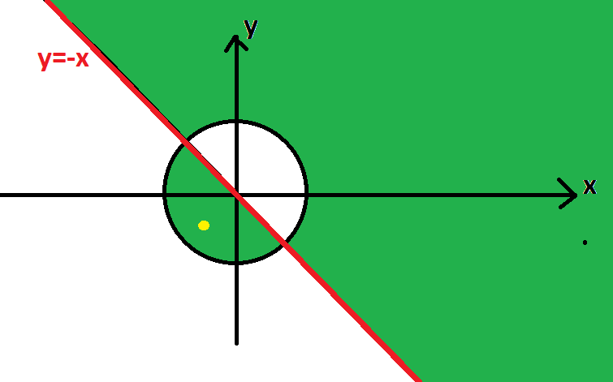

# Булеви изрази


### Задача 1 - Булев израз
Да се напише булев израз, който приема естествено число - година и има стойност истина, ако годината е високосна. Упътване: Една година е високосна, ако се дели на 4 и не се дели на 100 или ако се дели на 400.

### Задача 2
Нека са дадени положителните естествени числа a, b и c. Да се напише булев израз, който има стойност истина, ако квадратното уравнение ax<sup>2</sup> + bx + c = 0 има два реални, различни корена.

### Задача 3
Да се напише програма, която получава 5 цели числа. Първите две от тях образуват множеството A, където A съдържа всички цели числа между въпросните две числа, включително самите тях. Вторите две числа образуват множеството B, където B съдържа всички цели числа между въпросните две, включително самите тях.

Програмата да изведе:
-  Дали 5-тото число принадлежи на обединението на A и B
-  Дали 5-тото число принадлежи на сечението на A и B
-  Дали 5-тото число принадлежи на разликата на A с B
-  Без да използвате допълнителни проверки (освен резултатите от 1., 2. и 3.) определете дали 5-тото число принадлежи само в някое от множествата A или B.

**Пример**:
Вход:
```text
1 5 3 5 5
```
Изход:
```text
1
1
0
0
```

# Оператори if и switch 

### Задача 4 - Гориво
Автомобил трябва да измине X километра, като гори Y литра гориво за 100км.
Цената на горивото е Z лева/литър. Шофьорът разполага с A лева. Ако с тези пари е
достатъчно да се купи гориво, с което да се измине разстоянито от Х километра, програмата ви трябва да изведе "Yes".
Ако парите не достигат, програмата трябва да изведе "No", и дължината на пътя, който шофьора може да измине с наличните средства. На вход са дадени дробните
числа X, Y, Z и A.

**Пример**:  
Вход:
```text
160 6 3.10 25
```
Изход:
```text
No
134,4086
```
  
### Задача 5 - Линейно Уравнение
Дадени са коефициентите a и b на линейното уравнение $ax+b=0$. a и b са дробни числа. Напишете програма, която определя колко решения има уравнението. (Примерен изход: Every x is solution, One solution, No solution). Ако има едно решение, да се изведе стойността му.  
**Пример**:   
Вход:
```text
2.5 -3
```
Изход:
```text
One solution
1.2
```

### Задача 6 - Аналитична Геометрия
Даден е радиусът R на окръжност, чиито център съвпада с центъра на координатната система. Даден е и коефициентът k на уравнението на правата $y=kx$. Дадени
са и координатите на произволна точка (x,y). Позицията на точката е "Добра" ако се намира в окръжността и под правата или извън окръжността и над правата.(в зелената област на схемата). Напишете програма, която определя дали позицията на точката е "добра". На вохд са дадени дробните числа R, k, x и y.



**Пример**:  
Вход:
```text
2 -1
-1 -1
```
Изход:
```text
yes
```  
  
### Задача 7 - Триъгълник
Дадени са целите числа a, b и c. Напишете програма, която отпечатва "Yes" ако може да се построи триъгълник, дължините на страните на който са равни съответно на a, b и c, и "No" в противен случай. Ако е възможно да се построи, програмата да отпечата също и вида на триъгълника - тъпоъгълен(obtuse), правоъгълен(right), остроъгълен(acute).  
Бонус: Да се отпечата дали тръигълника е равностранен.  
**Пример**:  
Вход:
```text
3 5 4
```
Изход:
```text  
Yes
right triangle  
```


### Задача 8
Да се напише програма, която въвежда цяло число отпечатава с думи кой ден от седмицата е.

**Пример**:<br>
| Вход | Изход         |
|------|---------------|
| 1    | Monday        |
| 7    | Sunday        |
| 42   | Invalid input |


### Задача 9
Да се напише програма, която сортира три цели числа във възходящ ред.

**Пример**:  
Вход:
```text
2 4 3
```
Изход:
```text
2 3 4
```


### Задача 10
Да се напише програма, която получава 3 цифри и изписва на конзолата най-голямото число, което може да се получи от тях. Помислете за някой специфичен вход.

**Пример**:  
Вход:
```text
0 1 2
```
Изход:
```text
210
```


### Задача 11
Да се напише програма, която приема час `∈ [0, 23]` и минути `∈ [0, 59]` от 24-часово денонощие и изчислява колко ще е часът след 15 минути. Резултатът да се отпечата във формат hh:mm. Часовете и минутите се изписват винаги с по две цифри, с водеща нула когато е необходимо


**Пример**:  
| Вход | Изход         |
|------|---------------|
| 1 46    | 02:01        |
| 0 1    | 00:16        |
| 23 59   | 00:14 |


# #Бонус

### Задача 12
Напишете програма, която получава число от конзолата и прави следните проверки върху него: проверка за цялост, като ако числото е цяло прави проверка за четност, а ако не е - за знака му. Накрая да се извежда текст за това.

**Пример**:  
Вход:
```text
4
```
Изход:
```text
Even integer
```  
Вход:
```text
-5.5
```
Изход:
```text
Negative rational
```

### Задача 13 
Да се напише програма, която получава 3 цели числа, които символизират дата (ден, месец, година) определя и извежда следващата дата.

**Пример**:  
Вход:
```text
31 7 2020
```
Изход:
```text
1 8 2020
```

### Задача 14
Напишете програма, която приема число **n** (-1000 <= **n** <= 1000), която изписва стойността на **n** с думи. Помислете за някакъв pattern, който може да се преизползва.

### Задача 15
Да се напише програма, която приема 2 символа, които символизират карти, където `J` е вале, `Q` е дама, `K` е поп, `A` е асо, a `1` отговаря на `10`. Да се изведе дали въпросната ръка преминава 21 по правилата на играта Блек Джек.

**Пример**:<br>
Вход:
```text
1 A
```
Изход:
```text
true
```
