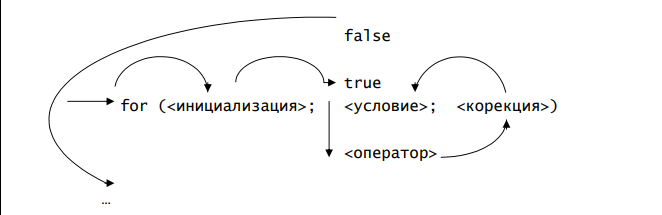

# Циклични процеси




? Да се намерят грешките в следните оператори:

```cpp
if (1 < x < 2) x = x + 1; y = 0;
else x = 0; y = y + 1;
```
```cpp 
if (1 < x) && (x < 2)
{
    x = x + 1;
    y = 0;
};
else{ 
 x = 0;
 y = y + 1;
};
```
## Задача 1 - Хакери

Вие участвате в нискобюджетна продукция на Боливуд, в която става въпрос за високоплатен програмист. Актьор сте, в същото време продуцент, в същото време и режисьор. Следва да заснемете сцена, в която се хаква фейсбука на приятелката на главния герой - все пак всеки уважаващ себе си програмист трябва да може да хаква фейсбуци. Както всичко останало, от вас зависи да напишете и програмата, която хаква фейсбук акаунта. Ако ли не - поне симулирайте такава! 

```text 
Hacking Avani Chaturvedi's Facebook account!!
Progress: 0%
Progress: 1%
...
Progress: 99%
We're in!!! 
```


## Задача 2
Напишете програма, която изрежда числата между 1 и 2 със стъпка 0.1

## Задача 3
Да се изведат всички цели числа от 1 до 100, които се делят на 5. 
Да се изведат всички цели числа от `p` до `q`, които се делят на `r`. 

## Задача 4 - Uno Reverse

Задача Напишете програма, която приема цяло число n. Да се изведат всички цели числа от n до 1, всяко на нов ред.


## Задача 5 - Сестричка
Малката ви сестричка си е скъсала таблицата за умножение точно на стълба със 7. Разпечеатайте я за нея. 

```text
1 * 7 = 7
2 * 7 = 14
3 * 7 = 21
4 * 7 = 28
5 * 7 = 35
6 * 7 = 42
7 * 7 = 49
8 * 7 = 56
9 * 7 = 63
10 * 7 = 70
```


## Задача 6 - Суми
Да се напише програма, която пресмята сумите:

 -  m + (m + 1) + (m + 2) + ... + (m + n);
 - 1 + 1/2 + 1/3 + 1/4 + … + 1/10.


## Задача 7
Да се напише програма, която въвежда от клавиатурата цялото число **n** > 0, след това въвежда още **n** числа и отпечатва сумата им и най-голямото от тях.

**Пример**:<br>
Вход:
```text
3
4 6 9
```
Изход:
```text
sum = 19
max = 9
```

## Задача 8 - Цифри
Дадено е неотрицателно цяло число с не повече от 9 цифри. Да се изведе сбора на цифрите му на четни позиции (отляво-надясно). Както и информация коя цифра по колко пъти се среща в числото. 

**Пример**:<br>
Вход:
```text
787653
```
Изход:
```text
17 (8 + 6 + 3)
3 - 1
5 - 1
6 - 1 
7 - 2
8 - 1
```


## Задача 9 - палиндром
Дадено е неотрицателно цяло число с не повече от 9 цифри. Да се изведе дали то е палиндром(тоест прочетено отляво надясно и отдясно наляво да е едно и също число). 

**Пример:**  
Вход:
```text
123321
```
Изход:
```text
true
```

## Задача 10 - Фибоначи
Напишете програма, която намира числото с индекс **n** в редицата на Фибоначи. Тя е дефинирана по следния начин:  
_F(0) = 0  
F(1) = 1  
F(n) = F(n-1) + F(n-2)_  
На вход е дадено естественото число n.  

**Пример:**  
Вход:
```text
10
```
Изход:
```text
55
```

## Задача 11 - Триъгълник
Напишете програма, която отпечатва правоъгълен триъгълник от звездички. Катетите на триъгълника са с дължина точно N звездички. На вход е дадено числото N.
Триъгълника да се отепчата така, че на k-тия ред да има точно k символа '*'.

**Пример:**  
Вход:
```text
5
```
Изход:
```text
*
**
***
****
*****
```

## Задача 12 - Просто?
Напишете програма, която по въведено цяло положително число **n** извежда дали е просто. Ако не е - изведете всичките му делители

**Пример**:<br>
|Вход | Изход | 
|--|---|
|47 | yes | 
|12 | 1 2 3 4 6 12 |


## Задача 13 - Екс Фактор
На стандартния вход ще получите числото n и още n на брой числа - оценките от журито на участник в състезание по ски скокове. Оценката дадена от член на журито представлява цяло не отрицателно число. Журито се състои от n члена, като има поне три на брой члена (n>=3). С цел да се намали ефекта от подкупване на член на журито, от оценките се махат най-високата и най-ниската и на останалите се смята средно аритметично, което е и финалната оценка на състезателя. Ако има няколко най-високи или най-ниски оценки, се махат точно по една от тях. При дадените оценки, на стандартния вход трябва да изведете финалната оценка на състезателя с два знака след десетичната запетая, закръглена надолу (примерно 5.649 се закръгля на 5.64 независимо че цифрата 9 на хилядните е >=5).

Пример:
```
Вход:
5
4 2 7 9 6
Изход:
5.66
```

## Задача 14 - Последователност
На стандартния вход ще Ви бъде дадено числото n и още n цели не отрицателни числа. Намерете най-дългия последователен участък с еднакви числа и изведете неговата сума. Ако има няколко най-дълги, които са с еднаква дължина, то изведете първата срещната отляво надясно.

Пример:
```
Вход:
13
4 1 1 1 1 2 2 1 1 3 3 3 3
Изход:
4
```
**Обяснение на примера**: В примера имаме пет последователности от съседни еднакви числа. Една четворка, четири единици, две двойки, две единици, и четири тройки. Най-дъгите последователности са четирите единици и четирите тройки (в края), обаче от тях най-вляво са четирите единици. Заради това извеждаме тяхната сума.


## Задача 15 - Неперово число  
Както знаете, неперовото число представлява границата на следния безкраен ред:  
$${\displaystyle e=\sum \limits _{n=0}^{\infty }{\frac {1}{n!}}=1+{\frac {1}{1}}+{\frac {1}{1\cdot 2}}+{\frac {1}{1\cdot 2\cdot 3}}+\cdots }$$
  
Напишете програма, която пресмята числто e, използвайки само първите **k+1** събираеми от безкрайния ред.
$${\displaystyle e\approx\sum _{n=0}^{k}{\frac {1}{n!}}=1+{\frac {1}{1}}+{\frac {1}{1\cdot 2}}+{\frac {1}{1\cdot 2\cdot 3}}+\cdots+ {\frac {1}{k!}}}$$

На вход е дадено естественото число **k**.
Изведете получения резултат с поне 10 цифри след десетичната запетая.  
Спрвака - точната стойност на **е**: 2.71828182845904523536028747135266249775724709369995....  

**Пример:**  
Вход:
```text
9
```
Изход:
```text
2.7182815256
```

## Задача 16 - 5тичка

Напишете програма, която приема цели числа и приключва работа, когато се въведат 5 положителни числа. Накрая да се изведе сумата, произведението и най-малкото от всички въведени числа.

**Пример:**  
Вход:
```text
-1 1 -1 1 1 -1 1 -1 1
```
Изход:
```text
min = -1 sum= 1 product= 1
```

## Задача 17 - Смахнат калкулатор 
Калкулатор смята прости изрази от вида `<число> <операция> <число> <операция>...`, където `<операция>` може да бъде `+`, `-`, `*`, `/`, а `<число>` е реално число. Въвеждането продължава до въведен знак `=`, а действията се изпълняват без приоритет по реда на въвеждане
**Пример**:<br>
Вход:
```text
3 + 2 * 5 / 2 + 5 =
```
Изход:
```text
17.5
```

# #Бонус

## Задача 18
 Изведете на екрана всички трицифрени числа, сумата на цифрите на които е двуцифрено число

## Задача 19
Въведете **n** и **n** на брой цифри. Изведете числото, което образуват, умножено по 5.

**Пример**:<br>
Вход:
```text
5
1 5 3 8 7
```
Изход:
```text
15387 * 5 = 76935
```

## Задача 20
На стандартния вход ще Ви бъдат дадени целите не отрицателни числа a, b, c и d. Изведете всички възможни тройки не отрицателни цели числа (x, y, z), които удовлетворяват уравнението: `a*x + b*y + c*z = d`.

Пример:
```
Вход:
6 3 8 24
Изход:
0 0 3
0 8 0
1 6 0
2 4 0
3 2 0
4 0 0
```

## Задача 21
Да се състави програма, която отпечатва всички числа, които са квадрати на целочислени числа и сa по-малки от числото *n*, което се въвежда от клавиатурата.

|Вход | Изход | 
|--|---|
|5 | 1 4 | 
|99 | 1 4 9 16 25 36 49 64 81|

## Задача 22
Да се напише програма, която извежда в нарастващ ред всички трицифрени естествени числа, които не съдържат еднакви цифри(/ и % да не се използват).

## Задача 23
Да се напише програма, която извежда на екрана всички трицифрени числа abc, за които е в сила: a + c = b. Такива са например числата 121, 341, 891, 770.
