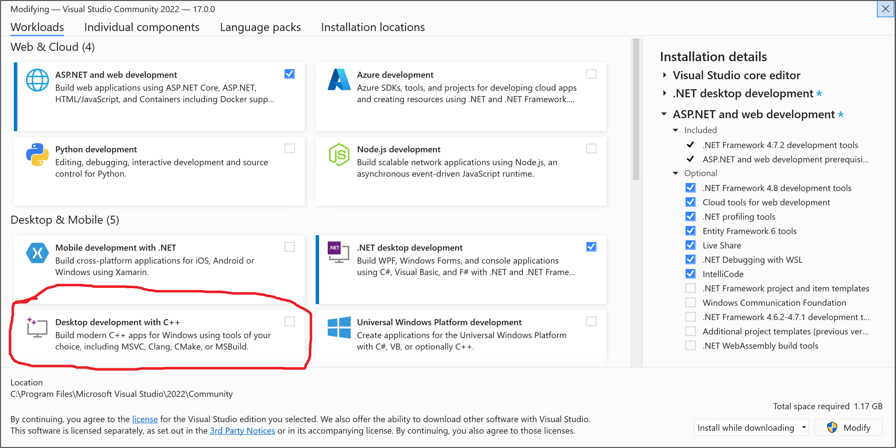

## Инсталиране на Visual Studio

Изтеглете Visual Studio Community от тук: https://visualstudio.microsoft.com/vs/community/ и следвайте стъпките в инсталатора.  
По време на иснталацията трябва да изберете C++ пакета (Desktop developmnet with C++):

Ако вече сте инсталирали Visual Studio и нямате поддръжка на C++, отидете в менюто на VS -> Tools -> Get Tools and Features
