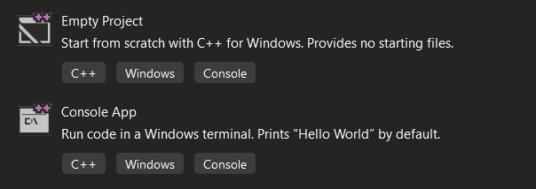

## Инсталиране на Visual Studio

Изтеглете Visual Studio Community от тук: https://visualstudio.microsoft.com/vs/community/ и следвайте стъпките в инсталатора.  
По време на иснталацията трябва да изберете C++ пакета (Desktop developmnet with C++):

Ако вече сте инсталирали Visual Studio и нямате поддръжка на C++, отидете в менюто на VS -> Tools -> Get Tools and Features

## Създаване на проект
Можете да създате проект при стартиране на VS или от File->New->Project. Изберете Console App

Автоматично се създава нов проект с примерен код на C++, както и нов Solution, който съдържа проекта. Един Solution може да съдържа няколко проекта. Съдържанито на проекта(проектие) може да видите в Solution Еxplorer. За да откриете чрез файловата система на уиндоус файла с кода, натиснете проекта с десен клик в Solition Explorer и след това Open Folder in File Explorer. Търсеният файл ще е с разширение cpp. Него ще трябва да предавате като приключвате контролни изпити и домашни.

За да отворите съществуващ проект, намерете папката с проекта във file explorer или във VS->File->Open->Project/Solution. В същата директория се намира sln файл, чрез който се отваря проекта. Друг начин е да влезете в папката с проекта и да отворите vcxproj файла.

